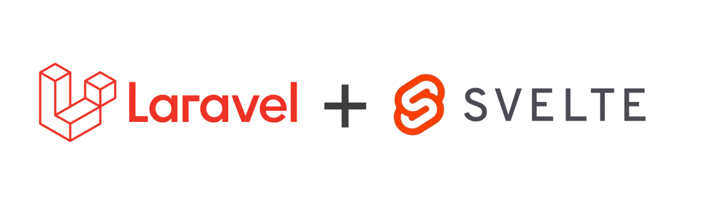

<p align="center"></p>

## About the Project

This project is a starter-kit-ish for projects that intend to use Laravel + Svelte + TailwindCSS + InertiaJS, thus, creating a unified workflow for Javascript and PHP.

## Installing the project

- First, clone the repository using this command
```bash
git clone https://github.com/Visnicio/laravel-svelte-tailwind.git
```
- Next, install the dependencies using this command
```bash
cd laravel-svelte-tailwind
composer install
npm install
```
- Start the servers and you are ready to go!
```bash
php artisan serve
npm run dev
```

## New to Inertia + Laravel?
No need to worry, the projects's main route ('/') is already configured with inertia and getting data from a endpoint, so you can follow the same logic for your own routes.

### File Structure
If you have questions about the file structure and how it works, its almost indentical to Laravel with you already worked with it in the MVC pattern.
- `resources/js/app.js` - Lays the configuration for Inertia on the ClientSide.
- `resources/js/Pages/*` - Here it will contain all the pages for your project.

## Learning Laravel

If your completely new to Laravel, you can learn more on the [documentation](https://laravel.com/docs).
